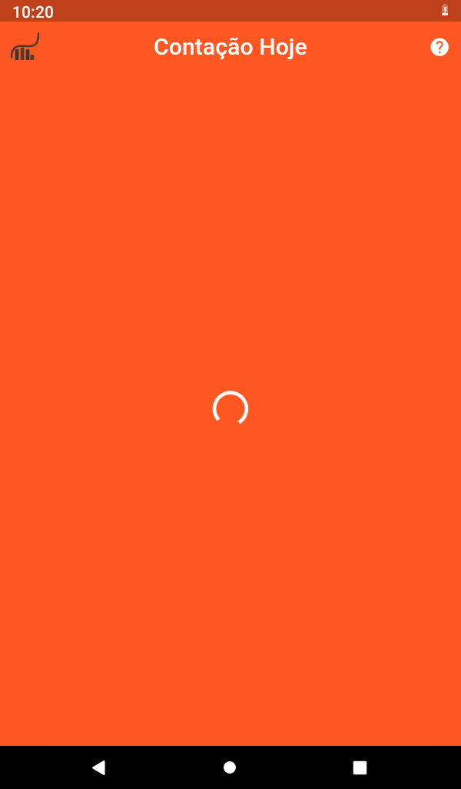

<h1 align="center">
  <br>
  <a href=""></a>
  <br>
  Cotação Hoje 
  <br>
</h1>

 <h4 align="center">Recebe as cotações atualizadas rápido e fácil no seu celular - <a href="https://flutter.dev" target="_blank">Cotação Hoje</a>.</h4>
 <h3>Aplicativo desenvolvido com <a href="https://flutter.dev" target="_blank">Flutter</a> usando Api do <a href="https://hgbrasil.com/status/finance" target="_blank">HG Brasil</a> para consumir os dados.</h3>

 <p float="left">
  
</p>


<table>
  <theade>
    <th>01</th>
    <th>02</th>
    <th>03</th>
  </theade>
  <tbody>
    <td></td>
    <td></td>
    <td></td>
   </tbody>
</table>

## Como usar
Para executar esse projeto voçê precisar ter instalado o [Git](https://git-scm.com) e 
[Flutter](https://flutter.dev/docs/get-started/install) em seu computador.

Tendo o Flutter e Git instalado voçê pode rodar o commando
```bash
$ git clone https://github.com/gabriel-oliveira800/cotacao-hoje-app-flutter
```
para clone esse repositorio no seu máquina. Entre nas pasta do projeto e execute o flutter no seu emular ou celular.
```bash
$cd myproject

# Install dependencies
$ flutter packages get

# Run the app
$ flutter run

# Build app
$flutter build apk
```

O Cotação Hoje já esta em produção acesse agora a Google Play e instale em celular.
<a href="https://play.google.com/store?hl=pt_BR&gl=US"><a/>

## Recursos
<ul>
  <li>Flutter version: 1.23.0 - channel beta</li>
  <li>
    Dependencies
    <ul>
      <li>Dio: 3.0.10</li>
      <li>google_fonts: 1.1.1</li>
      <li>flutter_svg: 0.19.1</li>
    </ul>
  </li>
</ul>

Para ter acesso a API do <a href="https://hgbrasil.com/status/finance" target="_blank">HG Brasil</a> é necessário se cadastra 
na plaforma e gerar sua chave, com ela voçê poderá realizar requisições no seu aplicativo.

Tendo sua chave da voçê poderá usa-la no projeto, entre na pasta raiz do seu projeto e 
acesse ``` lib/utils/utils.dart ``` e modifique a variavel ``` pathToCurrencies ``` 
para ``` 'https://api.hgbrasil.com/finance?key={my_key}' ``` alterando ``` my_key ``` pela sua chave.

Acesse https://api.hgbrasil.com/finance para saber mais.
